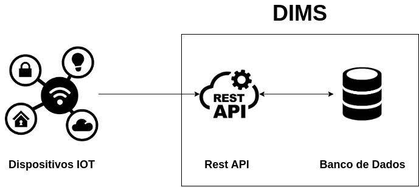

# DevKit-Software

 O UIoT DIMS é uma plataforma de middleware aberta para Internet das Coisas (IoT), projetada para gerenciar e armazenar dados provenientes de dispositivos IoT. Mantida pela Universal Internet of Things e pela Universidade de Brasília, o DIMS atua como uma camada entre aplicativos/dispositivos IoT e o sistema de armazenamento.


## Arquitetura do DIMS
O DIMS (Data Interface Management System) é um componente do UIoT, desenvolvido para gerenciar a interface de dados entre dispositivos IoT e o sistema de armazenamento. Ele recebe dados de sensores IoT e os armazena em um banco de dados, assegurando persistência e permitindo análises futuras.



### Funcionalidades Principais do DIMS:
- Recebimento de dados em tempo real de sensores IoT.
- Armazenamento seguro e confiável dos dados em um banco de dados centralizado.
- Fornecimento de uma interface padronizada para integração com dispositivos IoT.
- Suporte para análises posteriores e visualizações de dados.
- Escalabilidade para lidar com grandes volumes de dados de dispositivos IoT.

O DIMS é estruturado em três componentes principais:
- Cliente: Representa os dispositivos físicos de hardware, como Arduino, Raspberry Pi, etc.
- Serviços: Correspondem aos diferentes tipos de sensores presentes nos dispositivos físicos.
- Dados: Consiste nos dados gerados pelos sensores dos dispositivos físicos.
Essa divisão simplifica a compreensão da plataforma e dos fluxos de dados.

## Configuração e Utilização do DIMS
Para começar a utilizar o DIMS, é necessário entender os pontos de acesso e os passos iniciais para o envio de dados.
### Acesso aos Endpoints
- Endpoint principal do DIMS: http://dims.uiot.redes.unb.br.
- Documentação Swagger da API: http://dims.uiot.redes.unb.br/docs.
### Cadastro de Cliente
Para enviar dados ao DIMS, é preciso registrar um cliente via POST no endpoint http://dims.uiot.redes.unb.br/client, com o seguinte esquema:

```
{
 "clientTime": "2020-03-04T12:14:25",
 "tags": ["example-tag"],
 "name": "Raspberry PI",
 "chipset": "AMD 790FX",
 "mac": "FF:FF:FF:FF:FF:FF",
 "serial": "C210",
 "processor": "Intel I3",
 "channel": "Ethernet",
 "location": "-15.7757876:-48.077829"
}
```
Após o cadastro do cliente, é possível criar serviços associados a ele.

### Cadastro de Serviço
Cada cliente pode ter vários serviços diferentes. Para cadastrar um serviço, utilize o endpoint via POST http://dims.uiot.redes.unb.br/service, com o seguinte esquema:
```
{
 "clientTime": 1000000000.1,
 "tags": [
   "example-tag"
 ],
 "number": 3,
 "chipset": "AMD 790FX",
 "mac": "FF:FF:FF:FF:FF:FF",
 "name": "Get temp",
 "parameter": "temperature",
 "unit": "°C",
 "numeric": 1
}

```
O chipset e o mac são referentes ao cliente, enquanto os demais parâmetros são relacionados às características do serviço.
### Envio de Dados
Após o cadastro do cliente e do serviço, é possível enviar dados ao DIMS utilizando o endpoint POST http://dims.uiot.redes.unb.br/data, com o seguinte esquema:
```
{
 "clientTime": 1000000000.1,
 "time": "2018-09-21T17:42:12.587934",
 "tags": [
   "example-tag"
 ],
 "sensitive": 1,
 "chipset": "AMD 790FX",
 "mac": "FF:FF:FF:FF:FF:FF",
 "serviceNumber": 3,
 "value": [
   "20.2",
   "30.0"
 ]
}
```
Os parâmetros chipset e mac são relacionados ao cliente, enquanto serviceNumber é relacionado ao serviço. O parâmetro de sensitive é relacionado a qual importância desse dado que está sendo enviado.


Essas etapas permitem a integração e o envio eficiente de dados ao DIMS para posterior análise e utilização.

### Listagem de Clientes, Serviços e Dados
Para listar todos os clientes, serviços e dados, utilize o método GET nos seguintes endpoints, respectivamente:
- http://dims.uiot.redes.unb.br/list/client
- http://dims.uiot.redes.unb.br/list/service
- http://dims.uiot.redes.unb.br/list/data

Para acessar informações detalhadas sobre clientes, serviços e dados registrados, utilize os métodos GET nos seguintes endpoints:
#### Client:
- Listar por nome: 
    - Exemplo: http://dims.uiot.redes.unb.br/list/client?name=HumidityCenter
- Listar por canal:
    - Exemplo: http://dims.uiot.redes.unb.br/list/client?channel=IEEE808002.11b
- Listar por chipset:
    - Exemplo: http://dims.uiot.redes.unb.br/list/client?chipset=AMD%20790FX
- Listar por endereço MAC:
    - Exemplo: http://dims.uiot.redes.unb.br/list/client?mac=FF:FF:FF:FF:FF
- Listar uma quantidade específica dos últimos cadastrados:
    - Exemplo: http://dims.uiot.redes.unb.br/list/client?latest=10
#### Service:
- Listar por nome:
    - Exemplo: http://dims.uiot.redes.unb.br/list/service?name=GetTemp
- Listar por parâmetros:
    - Exemplo: http://dims.uiot.redes.unb.br/list/service?parameters=humidity
- Listar por chipset:
    - Exemplo: http://dims.uiot.redes.unb.br/list/service?chipset=AMD%20790FX
- Listar por endereço MAC:
    - Exemplo: http://dims.uiot.redes.unb.br/list/service?mac=FF:FF:FF:FF:FF
- Listar uma quantidade específica dos últimos cadastrados:
    - Exemplo: http://dims.uiot.redes.unb.br/list/service?latest=10
#### Data:
- Listar por sensibilidade:
    - Exemplo: http://dims.uiot.redes.unb.br/list/data?sensitive=1
- Listar por chipset:
    - Exemplo: http://dims.uiot.redes.unb.br/list/data?chipset=AMD%20790FX
- Listar por endereço MAC:
    - Exemplo: http://dims.uiot.redes.unb.br/list/data?mac=FF:FF:FF:FF:FF
- Listar por número do serviço:
    - Exemplo: http://dims.uiot.redes.unb.br/list/data?serviceNumber=3
- Listar por data:
    - Exemplo:
        http://dims.uiot.redes.unb.br/list/data?from=1995-09-07T10:40:52Z
        http://dims.uiot.redes.unb.br/list/data?until=1998-09-07T10:40:52Z
        http://dims.uiot.redes.unb.br/list/data?from=1995-09-07T10:40:52Z&until=1998-09-07T10:40:52Z
- Listar uma quantidade específica dos últimos cadastrados:
    - Exemplo: http://dims.uiot.redes.unb.br/list/data?latest=10
    
Esses parâmetros permitem filtrar os resultados para atender às necessidades específicas de consulta.

